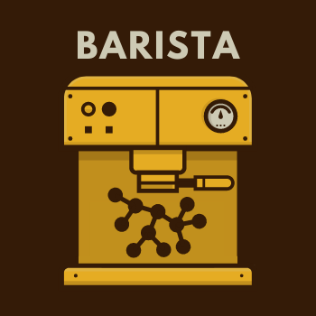
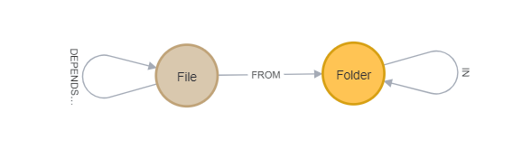

# Barista

Brew Neo4j graph from your client-side codebase using madge

###### Project is in Pre-Alpha phase !!!
###### Repository is under development !!!
###### Not ready to use !!!

## Build and Run

- Install madge `npm -g install madge`
  - tool to scan entires and generate source files
- Run `docker-compose up` to start Neo4j instance
- Run `npm install`
- Run `npm run barista` **not work**
- Wait while graph is brewing...
- Graph is ready to use `http://localhost:7474`

## Graph

- user/password: neo4j/barista
- schema:
  - `Folder` - `IN` -> `Folder`
  - `File` - `FROM` -> `Folder`
  - `File` - `DEPENDS_ON` -> `File`

## Cypher

When Barista create a graph you can mind some data insights from it.
In `cypher` folder we collect some initial list of queries good to start with.

List of queries:
- [level-dependency.cql](./cypher/level-dependency.cql)
  - use `[:DEPENDS_ON*1..N]` to look deep in nested dependencies
